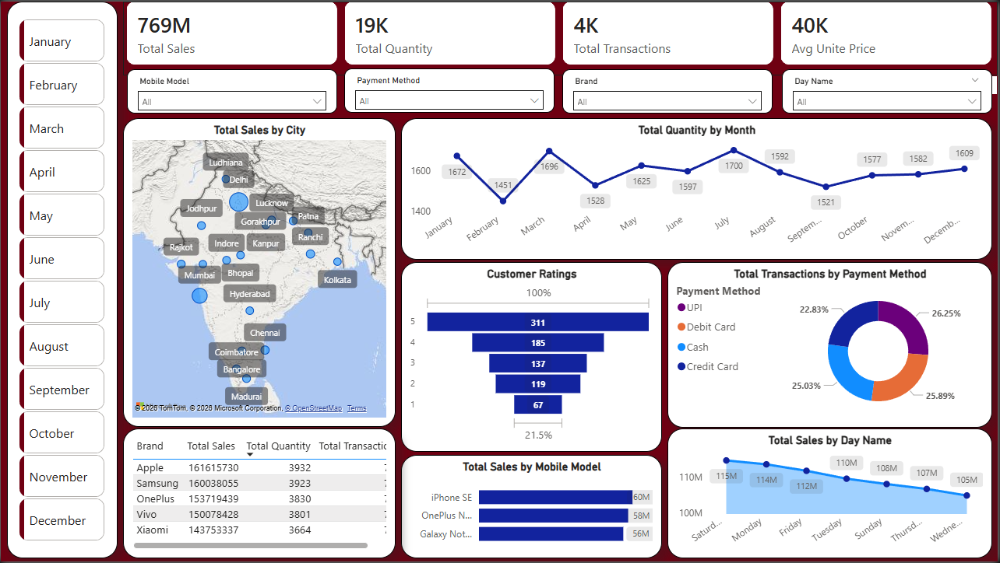

# 📊 Mobile Sales Dashboard | Power BI

## 📌 Project Overview

This is my **first Power BI dashboard**, developed as part of my Data Analytics learning journey. The dashboard provides an interactive analysis of mobile sales data, enabling users to explore business performance through dynamic visualizations, KPIs, and filters.

The objective of this project was to transform raw sales data into meaningful business insights using Power BI's data modeling, DAX, and visualization capabilities.

---

## 🖼️ Dashboard Preview

> **Dashboard Screenshot**



---

## 🎯 Project Objectives

- Analyze overall mobile sales performance.
- Track sales across different cities and regions.
- Compare sales by mobile brands.
- Analyze customer purchasing behavior.
- Monitor payment methods used by customers.
- Identify monthly and daily sales trends.
- Build an interactive dashboard using slicers and filters.

---

## 📈 Key Performance Indicators (KPIs)

- 💰 Total Sales
- 📦 Total Quantity Sold
- 🛒 Total Transactions
- 📊 Average Sales Value

---

## 📊 Dashboard Features

- Interactive KPI Cards
- Sales Trend Analysis
- Brand-wise Sales Comparison
- City-wise Sales Distribution
- Customer-wise Sales Analysis
- Payment Method Analysis
- Monthly Sales Performance
- Dynamic Filters & Slicers
- Interactive Report Navigation

---

## 🛠️ Tools & Technologies

- **Power BI Desktop**
- **Power Query**
- **DAX (Data Analysis Expressions)**
- **Data Modeling**
- **Microsoft Excel**

---

## 📂 Repository Structure

```
📂 Mobile-Sales-PowerBI-Dashboard
│
├── 📂 Dataset
│   └── Mobile Sales Data.xlsx
│
├── 📂 PowerBI_Project
│   └── main_project.pbix
│
├── 🖼️ Dashboard.png
│
└── 📄 README.md
```

---

## 🚀 How to Use

1. Clone or download this repository.
2. Open the **.pbix** file using **Power BI Desktop**.
3. Refresh the dataset if required.
4. Explore the dashboard using the available slicers and filters.

---

## 💡 Skills Demonstrated

- Data Cleaning
- Data Transformation
- Data Modeling
- DAX Measures
- Dashboard Design
- Interactive Visualizations
- Business Intelligence
- Data Analysis
- Storytelling with Data

---

## 📚 Learning Outcomes

Through this project, I gained hands-on experience with:

- Building interactive dashboards in Power BI.
- Creating meaningful KPI cards.
- Working with DAX measures.
- Designing professional dashboard layouts.
- Converting raw business data into actionable insights.

As this is my **first Power BI project**, it marks an important milestone in my journey toward becoming a Data Analyst.

---

## 📌 Future Improvements

- Add more advanced DAX measures.
- Improve dashboard responsiveness.
- Include drill-through pages.
- Add forecast and trend analysis.
- Optimize performance for larger datasets.

---

## 👨‍💻 Author

**Kamlesh Lohar**

Aspiring Data Analyst passionate about transforming data into actionable insights through visualization, analytics, and business intelligence.

---

⭐ If you found this project helpful or interesting, feel free to give this repository a **Star**.
